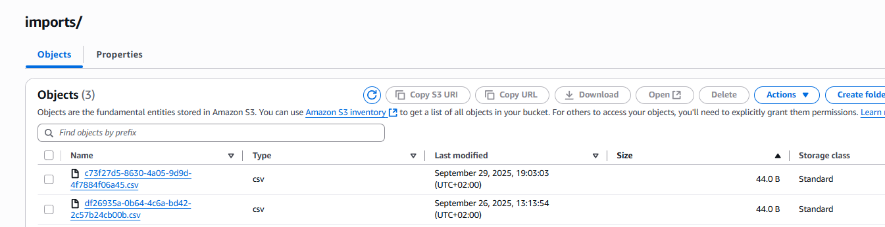

# Översikt
Detta projekt är en Java Spring Boot-applikation som importerar CSV-filer till AWS. Applikationen hanterar filuppladdning, databasskrivning och notifiering, körs helt i molnet
via Elastic Beanstalk(EC2).

### Flöde i korthet:
1. Källkod pushas till GitHub.
2. CodePipeline bygger via CodeBuild och deployar till Elastic Beanstalk (EC2).
3. Applikationen laddar upp CSV till S3 via presigned URL.
4. CSV-data läses och sparas till DynamoDB.
5. En notifikation skickas via SNS (Simple Notification Service).
6. AWS X-Ray spårar flödet och prestandan.
7. IAM-roller hanterar rätt åtkomst.
8. Step Functions används för att visa hur processen kan bearbetas i flera steg.

---
# Arkitektur

---

# AWS-tjänster i projektet
### S3 - Filuppladdning
* Tar emot CSV-fil via presigned URL.
* Bucket: csv-importer-bucket-tony.

### DynamoDB - Databas
* Tabell: DataItems.
* Varje Csv-rad sparas som id, name, age.
* Applikationen räknar antal importerade och misslyckade poster.

* ImportJobs i DynamoDB ⬇️ 

### SNS - Notifiering
* Topic csv-importer-events.
* Skickar en summering när importen är färdig (processed, failed, status).
* Kan kopplas till e-mail eller andra system (Jag körde e-mail).

### Step Functions
* Visar hur ett enkelt arbestflöde (ValidateInput -> PublishToSNS).

### Elastic Beanstalk (EC2)
* Kör applikationen automatiskt med lastbalansering och autocaling.
* All konfiguration för miljön hanteras genom EB -> Enviroment -> Software.

* Valde t3.micro i början vilket va lite för lite så den larmade hela tiden om för högt CPU bruk

### CodePipeline & CodeBuild
* Full CI/CD flöde:
  * Källa: GitHub.
  * Build: CodeBuild.
  * Deploy Elastic Beanstalk.
* Bygglogg och status syns direkt i AWS - Konsolen.

### X-Ray
* Spårar API anrop, S3 läsningar, DynamoDB skrivningar.
* Ger översikt över alla beroenden.

* I X-Ray:s trace map ser man hur applikationen kommunicerar mellan S3 och DynamoDB, vilket verifierar att datan laddas 
och sparas korrekt. SNS-notifieringar visas inte i trace-grafen eftersom de körs i bakgrunden
och fungerar som separata händelser via AWS SDK.

### IAM-roller & behörigheter
* EC2/EB-rollen:
  * s3:GetObject, dynamodb:PutItem, sns:Publish, xray:PutTraceSegments.
* CodePipeline-rollen:
  * elasticbeanstalk:UpdateEnviroment, s3:*Object, codebuild:StartBuild.
* CodeBuild-rollen:
  * Läsa/Skriva till S3.

---

# Testning
Test gjordes via Postman:
1. Generera presigned URL -> ladda upp CSV till S3.
2. Starta importen -> applikationen läser filen, skriver till DynamoDB och SNS.
3. Kontrollera status och loggar och se resultat i DynamoDB och SNS.
4. Spåra med X-Ray.

---
# Infrastruktur & CI/CD
* CodePipeline körs vid varje push till GitHub.
* CodeBuild bygger projektet.
* Elastic Beanstalk uppdaterar EC2 Instansen.
* X-Ray loggar händelser.
* IAM-roller garanterar säker kommunikation mellan tjänsterna.